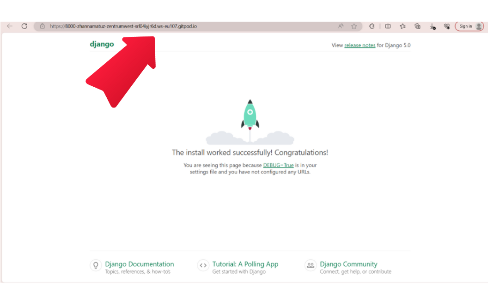
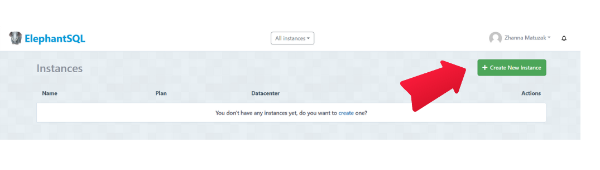
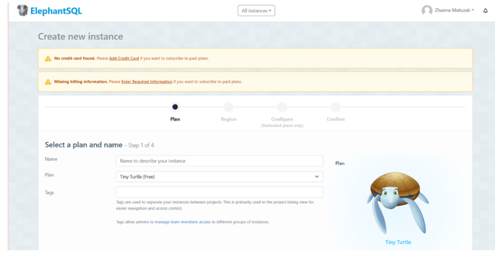
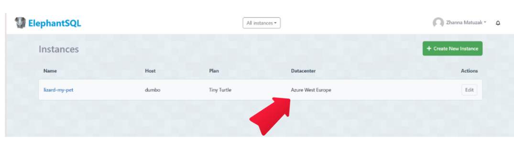
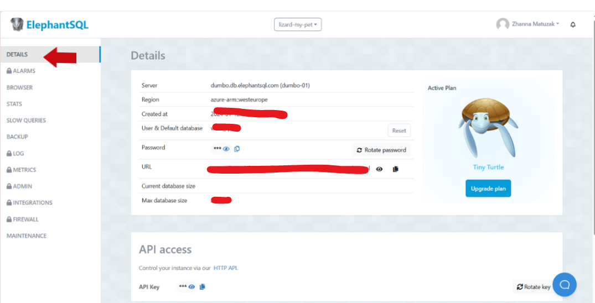
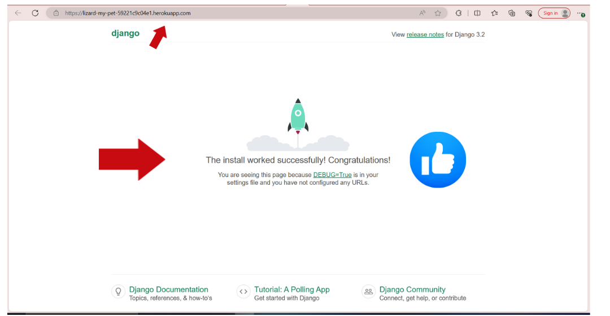

# Lizard Is My Pet

This Django project functions as a specialized blog designed for individuals contemplating the idea of adopting a lizard as a pet. It caters not only to those in search of essential information for decision-making but also to experienced lizard owners eager to share their firsthand experiences. Owners are invited to share insights into various aspects of daily life with their lizard, including preferred food choices, potential size and growth, lifespan, and even unique names for these captivating pets. The administrator provides visitors with posts about various lizard species, offering a comprehensive overview to assist them in making informed decisions. Simultaneously, visitors who have a lizard as a pet can actively contribute by sharing their own experiences in the experience (comments) section below each post. Reading about the experiences of others serves as a valuable resource for decision-making too. Only registered users have access to submit their experiences across all posts.


[Link to live site](https://lizard-my-pet-59221c9c04e1.herokuapp.com/) 


## Deployment

This project was deployed using [Heroku](https://heroku.com/), [Cloudinary](https://cloudinary.com/), [ElephantSQL](https://www.elephantsql.com/) and [Whitenoise](https://whitenoise.evans.io/en/latest/). 


#### Installing libraries

- Install **Gunicorn** (server used to run Django on Heroku): 
``pip3 install django gunicorn``
- Install **pyscopg2** (connects to PostgreSQL): 
``pip 3 install dj_database_url pyscopg2``
- Install **Cloudinary** (host static files and images): 
``pip3 install dj3-cloudinary-storage``
- Install **Whitenoise** (prevent issues with Heroku not rendering custom stylesheet): ``pip3 install whitenoise``

#### Getting set up

- Create **requirements.txt file** (keeps track of the modules and packages used in your projects): 
``pip3 freeze --local > requirements.txt``
- Create **new Django project**: 
``django-admin startproject lizardmypet .``
- Create **blog app** (name of the repo will be "blog"): 
``python3 manage.py startapp blog``
- Create **add blog app to installed apps** (the blog app needs to be added to the list of installed apps in the settings.py)
- Migrate **changes to the database** (when there is a new app, migrations are automatically created): 
``python3 manage.py migrate``
- Run **project** (It will show the error states your specific host. Copy and paste it into the settings.py file ALLOWED_HOSTS.): 
``python3 manage.py runserver``

If everything works, it will appear this:


#### Creating the Heroku App

- Log into Heroku and go to the Dashboard;
- In your new app’s settings tab, ensure the Config Var DISABLE_COLLECTSTATIC key has a value of 1.
- Click **New** and select **Create new app** from the drop-down;
- Name app appropriately and choose relevant region, then click **Create App**;
- Install the webserver gunicorn and add it to the project requirements:
``pip3 install gunicorn~=20.1``
``pip3 freeze --local > requirements.txt``
- Create a Procfile at the root directory of the project, declare the process as web and add a start command:
``web: gunicorn codestar.wsgi``
**Hint:** Note there is a space after the colon.
**Hint:** The Procfile has no file extension.

#### Create PostgreSQL database using ElephantSQL

This is necessary to create a database that can be accessed by Heroku. The database provided by Django can not be accessed by the deployed Heroku app.

- Log into ElephantSQL and go to Dashboard;
- Click **Create New Instance**



- Set up a plan by providing a Name (project name) and select a Plan (for this project the free plan "Tiny Turtle" was chosen). Tags are optional;



- Click **Select Region** and choose appropriate Data center;



- Click **Review**, check all details and click **Create Instance**;
- Return to Dashboard on click on the name of the newly created instance;
- Copy the database URL from the details section.



#### Hiding sensitive information

- Create ``env.py`` file and ensure it is included in the ``.gitignore`` file
- Add ``import os`` to env.py file and set environment variable **DATABASE_URL** to the URL copied from ElephantSQL (``os.environ["DATABASE_URL"]="<copiedURL>"``)
- Below, set **SECRET_KEY** variable 
``os.environ["SECRET_KEY"]="mysecretkey"``.
Hier I have generated the key: [Django Secret Key Generator](https://miniwebtool.com/django-secret-key-generator/)

#### Update Settings

- Add the following code at the top of ``settings.py`` to connect Django project to env.py:
    ````
      import os
      import dj_database_url
      if os.path.isfile('env.py'):
          import env
    ````
- Remove insecure secret key provide by Django in settings.py and refer to variable in env.py instead (``SECRET_KEY = os.environ.get('SECRET_KEY')``)

- To connect to new database, replace provided **DATABASE** variable with 
    ````
    DATABASES = {
        'default': dj_database_url.parse(os.environ.get("DATABASE_URL"))
    }
    ````
- Save and migrate all changes made.
`python3 manage.py migrate``

#### Connecting Heroku to Database

- In Heroku dashboard, go to **Settings** tab;
- Add three new config vars **DATABASE_URL** (value is database URL), **SECRET_KEY** (value is secret key string) and **PORT** (value "8000").

#### Connect to Cloudinary

- In Cloudinary dashboard, copy **API Environment variable**
- In ``env.py`` file, add new variable ``os.environ["CLOUDINARY_URL"] = "<copied_variable"`` and remove ``CLOUDINARY_URL=`` from the variable string
- Add same variable value as new Heroku config var named **CLOUDINARY_URL**
- In ``settings.py``, in ``INSTALLED_APPS`` list, above ``django.contrib.staticfiles`` add ``cloudinary_storage``, below add ``cloudinary``
- To define Cloudinary as static file storage add the following to settings.py
    ````
    STATICFILES_STORAGE = 'cloudinary_storage.storage.StaticHashedCloudinaryStorage'

    DEFAULT_FILE_STORAGE = 'cloudinary_storage.storage.MediaCloudinaryStorage'
    ````

#### Allow Heroku as host

- In ``settings.py`` add
    ````
    ALLOWED_HOSTS = ['app-name.herokuapp.com', 'localhost']
    ````
If everything works successfully during the deployment process, it will look like this:



##### Fixed Bugs

- Problem 1:  When renaming the my Django project, I have manually changed the project folder's name only.

  - *Solution 1: Renaming a Django project typically involves manually changing the project folder's name, but it also requires updating references to the old project name in various files within the project. Here's a summary of the steps involved:*
    - Rename the Project Directory;
    - Rename the root directory of your Django project to the new project name;
    - Update manage.py and wsgi.py Files;
    - Inside the project directory, there are files named manage.py and wsgi.py. Update these files to use the new project name.
    - Update the settings.py File;
    - Open the settings.py file inside your project folder and change the ROOT_URLCONF to point to the new project name.
    - Update database tables to reflect the new project name. You can do this using Django migrations.
    ``python manage.py makemigrations``
    ``python manage.py migrate``
    - Update the ASGI_APPLICATION (if applicable);
    - Update ASGI_APPLICATION setting to use the new project name.
    - Update wsgi.py:
        - Open the wsgi.py file in the root of your project folder.
        - Inside wsgi.py, find the line that looks like this:
        ``os.environ.setdefault('DJANGO_SETTINGS_MODULE', 'oldproject.settings')``
        - Update the project name to the new name:
        ``os.environ.setdefault('DJANGO_SETTINGS_MODULE', 'newproject.settings')``

- Problem 2: By deploying the project to Heroku I have got H10-App Crashed Error.
  - *Solution 2: I found the answer to this problem from [Igor Basuga](https://github.com/bravoalpha79) on slack.
  So, I checked, as Igor recommend, if Requirements.txt file is not updated, if Typo is in Procfile, or if one or more of the required Heroku Config Vars missing. These three possible issues I have not had. 
  Finally, I checked other files and found out that when changing the project name, my changes to wsgi.py file was not saved.*

## Credits

#### Code

 1. [MinValueValidator](https://stackoverflow.com/questions/44022056/validators-minvaluevalidator-does-not-work-in-django) -  MinValueValidator was used to help validate the max_size, lifespan, proce_from, price_to fields in the `LizardModel` in Models.py file, to ensure that the values of max_size, lifespan, proce_from, price_to are greater than or equal to 1.
 2. []() -  
 3. []() -
 4. []() - 