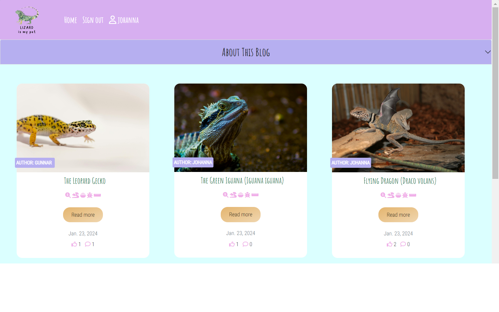
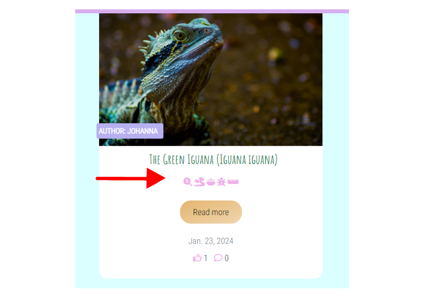

# Lizard Is My Pet

## Introduction & Project's Goal

This Django project functions as a specialized blog designed for individuals contemplating the idea of adopting a 🦎 lizard as a pet. It caters not only to those in search of essential information for decision-making but also to experienced lizard owners eager to share their firsthand experiences. Owners are invited to share insights into various aspects of daily life with their lizard, including preferred food choices, potential size and growth, lifespan, and even unique names for these captivating pets. The administrator provides visitors with posts about various lizard species, offering a comprehensive overview to assist them in making informed decisions. Simultaneously, visitors who have a lizard as a pet can actively contribute by sharing their own experiences in the experience (comments) section below each post. Reading about the experiences of others serves as a valuable resource for decision-making too. Only registered users have access to submit their experiences across all posts and to like the posts.

Desktop mockup:



[Link to live site](https://lizard-my-pet-59221c9c04e1.herokuapp.com/) 

---

### Agile Strategy

This project follows the agile approach, encompassing the entire development lifecycle from initial planning to final implementation. To illustrate the process, I established a [GitHub project](https://github.com/users/zhannamatuzak/projects/1) and employed the Kanban board method provided. This method facilitated the breakdown of project elements into user stories and manageable tasks.

Ensuring the successful implementation of user stories is fundamental to this project. It involves testing to confirm that the delivered features align with specified criteria.

To access comprehensive details, including acceptance criteria and tasks for each user story, please refer to the linked project above. Additionally, each story is categorized with a labeled indicator, signifying its importance to the overall functionality and acceptability of the site. The user stories are closely aligned with their respective epics (Full User Managment, Manage posts, Create, Editing and Deleting Experiences), and three epics are organized under the milestone "Create the full Backend and Frontend". For a detailed view of user stories, please refer to the ['Testing.md'](https://github.com/zhannamatuzak/lizard-my-pet/blob/main/TESTING.md) document."

### Scope

The scope of this project encompasses a set of features designed to create an engaging and interactive blog centered around lizards (posts).

- Admin created lizards (posts) with full CRUD functionality from the backend;
- Lizards (posts) List and Detailed Lizard webpages;
- User account creation;
- User shared experiences (comments) with full front-end CRUD functionality;
- User likes with full front-end CRUD functionality;
- Identify and show seit user mumber of shared experiences (comments) per Lizard (post).

## Design Choices

### Colors

- The colourful color palette was used as a topic is about lizards. 
- The headings, icons and body text are darker to ensure clear contrast and readability for the user across the site.
- The pink header and footer ensures clear contrast and delineation between sections.
- The background color of the main is light blue.
- The area with the text is almost on the white background.

I used this palette to style the blog:

To see the color palette, [click hier](documentation/palette_color.jpeg)

### Typography

- The font combination I have seen on the website of one CI student. I liked it and implemented it in my project.
- The headings use Amatic SC with a fallback of cursive and the body text uses Roboto Condensed with a fallback of san-serif.

### Icons

- The icons on the paginated post list provide a clear understanding of each section on the post.



- The familiar Edit and Delete icons were utilized beneath shared experiences (comments) for user convenience.


### Animations: links & buttons

- The navbar, social icons (white) and buttons across the site have effects when hovered over by the user.


- All links have a dark brown color and change the color to light brown when hovered for clear distinction from the body text.

### Responsiveness
- The website was designed mobile-first using flexbox to ensure responsiveness throughout the website.
- The standard grid from Bootstrap was used to achieve this.

### Wireframes

The initial wireframes in [canva](https://www.canva.com/) are an overly simplified version of the finished product and merely served the purpose of listing most of the site's essential features.

#### Home Page


#### Detailed view of a Post


Not all features and functions are covered by these wto drafts.

About all existing features read below ↓↓↓

---

## Features

### Navigation

- The users will have a choice of home, login/logout & register (signup) when visiting the site. 
- There is a subtle hover state on each of the navigation items for better user experience.
- For mobile devices, the navigation toggles to a hamburger menu.
- The logo is placed on the left side of the navitems and it was generated using Canva.
- When the user is signed up, he/she can see his name and user icon on the navbar next to the navicons.

Site visitor: 


Registered user:


Hamburger menu:


### Lizard List

- The users will have a list of posts about lizards with a title, icons that tell about the post content, “Read more” button, icons with likes and shared experiences counts, and the date.
- The image and “read more” button are linked, so users may click on either and be taken to the lizard detail page.
- There is a hover state on the button to show the user they can click on it and be brought to the lizard detail page.
The author's name is on the image.


### Lizard Detail

- Each lizard post has four sections: 
  - image with the discussed lizard,
  - description with title and author,
  - information about maximum size, lifespan and prices,
  - diet information.


### Likes

- If the user isn't logged in, he/she will see the below information:


- If the user is logged in, they will be able to like the post:


- The user is able to easily return to the home page using the go back button or clicking the logo at the top of the page.

### Shared experiences (Comments)

- If a lizard post doesn't have any shared experiences (comments), the user will not see the shared experience form.

- The user will be able to edit their comment using a form and be alerted using a message that disappears after 5 seconds.

- The user will be able to delete their comment after being prompted and can go back if desired or will proceed and receive a success message.


- Details about editing and deleting shared experiences, as well as the validation process during the creation, updating, and deleting of experiences, can be found in the corresponding user stories and test cases: [USER STORY: Share Experience (comment)](https://github.com/zhannamatuzak/lizard-my-pet/issues/16), [USER STORY: Editing Experiences](https://github.com/zhannamatuzak/lizard-my-pet/issues/15), [USER STORY: Delete Shared Experiences](https://github.com/zhannamatuzak/lizard-my-pet/issues/13).

### Register (sign up)

- The user will be able to easily sign up as a user using the below form.
- If users are already registered, there is a link to easily navigate to login instead

[signup form](documentation/signup_form.png)

### Login/Logout 

- The users can easily sign in using the below form with an option to 'remember me' if desired.
- If a user hasn't registered, there is a link to easily navigate to sign up instead.

[signin form](documentation/signin_form.png)

- The user is prompted with a message before logging out:

[log out](documentation/sign_out_page.png)


### Footer
- The footer links directly to the social media pages of the plant care blog.
- There is a subtle hover state on each icon for better user experience.

### Error 404/403/
- There are error pages in place in case a user is taken to a restricted area or the page doesn't exist.

### Features for Future Development

- to add modal for deleting shared experiences instead of using a separate delete page.
- Use JavaScript to reload or refresh an existing template. It will allow a form to be populated with an existing comment.  

---

## Database Design

The Database consists of three models:

* **USER:** where all data of each registered user is stored.

* **LIZARD:** where all data of each post is stored.

* **EXPERIENCE:** where all data of each written experience (comment) is stored.

The database model diagram was designed using [Lucidchart](https://www.lucidchart.com/pages/).


**USER MODEL**

In this project, Django's built-in application, contrib.auth, was utilized to manage user authentication and authorization. This application provides a comprehensive infrastructure encompassing models, views, and forms. Its functionalities extend to handling user authentication, password reset mechanisms, permissions, and more.


**Custom Models:**

**🦎LIZARD MODEL**

The Lizard model was customised according to the data needed for the "Lizard is my pet" blog concept.

| key          | Database Key   | Type             | Validation   |
|--------------|----------------|------------------|--------------|
|              | title          | CharField        | max_length=100, unique=True |           
|              | slug           | SlugField        | max_length=100, unique=True |
|   FK         | author         | User model       | User, on_delete=models.CASCADE |
|              | description    | TextField        | validators=[RegexValidator(regex=r'^[A-Za-z0-9\s\.,!?]*$')] |
|              | image          | CloudinaryField  | default='default' |
|              | created_on     | DateField        | uto_now_add=True |
|              | max_size       | IntegerField     | validators=[MinValueValidator(1)] |
|              | lifespan       | IntegerField     | validators=[MinValueValidator(1)] |
|              | price_from     | IntegerField     | validators=[MinValueValidator(1)] |
|              | price_to       | User Model       | validators=[MinValueValidator(1)] |
|              | diet           | CharField        | max_length=50, choices=DIET, default="0" |
|              | diet_list      | TextField        | validators=[RegexValidator(regex=r'^[A-Za-z0-9\s\.,!?]*$')] |
|              | status         | IntegerField     | choices=STATUS, default=0 |

❗ I had to change the "diet" variable field from Integer to CharField. 
To read more details about the **ISSUE*,* see [user issue 12](https://github.com/zhannamatuzak/lizard-my-pet/issues/12).

Variables for **choice:**

```
DIET = [
        ("0", "Not defined"),
        ("1", "Omnivorous"),
        ("2", "Herbivorous"),
        ("3", "Insectivorous"),
    ]
```

**Methods:**

```
  class Meta:
        ordering = ['-created_on']

    def __str__(self):
        return self.title

    def number_of_likes(self):
        return self.likes.count()
```

- [X] C - Site users can create/register their own profile to interact with the lizards posts.
- [X] R - Site users can open and read the lizard blog posts for details and read shared experiences (comments) from other users.
- [X] U - Site users can like a lizard (post), updating the details and analytics for a lizard detail post.
- [X] D - Site users can eliminate their like if desired on a lizard detail post.
<br>

**EXPERIENCE MODEL** 

| key          | Database Key   | Type             | Validation   |
|--------------|----------------|------------------|--------------|
|     FK       | post           | Lizard Model     | Lizard, on_delete=models.CASCADE |           
|     FK       | user           | User Model       | User, on_delete=models.CASCADE |
|              | pet_name       | CharField        | default="What's your pet name?", max_length=80, validators=[RegexValidator(regex=r'^[a-zA-Z]*$',)] |
|              | size           | IntegerField     | default=0, validators=[MinValueValidator(1), MaxValueValidator(100)] |
|              | body           | TextField        | default="Here can be your experience...", max_length=800 |
|              | created_on     | DateField        | uto_now_add=True |
|              | likes          | ManyToManyField  | User, related_name='post_like', blank=True |

**Methods:**

```
class Meta:
        ordering = ['created_on']

    def __str__(self):
        return f"Experience {self.body} by {self.user}, petname: {self.pet_name}, size: {self.size}cm"
```

- [X] C - Site users can create their own experiences (comments) using a validated form on each blog post.
- [X] R - Site users can read shared experience (comments) from other users.
- [X] U - Site users are able to update/edit their shared experiecnes (comments) using a form.
- [X] D - Site users are able to delete their shared experiences (comments).

---

## Testing

Please refer to the [TESTING.md](TESTING.md) file for all testing performed.


## Technologies Used

### Work Environments and Hosting

- [Lucid](https://lucid.app/) (ERD diagrams)
- [GitHub](https://github.com/) (Version control)
- [GitPod](https://gitpod.io/) (IDE)
- [Heroku](https://heroku.com/) (Site hosting)
- [Cloudinary](https://cloudinary.com/) (Serving static media files)

### Python Libraries

- [Gunicorn](https://docs.djangoproject.com/en/4.1/howto/deployment/wsgi/gunicorn/) - Python HTTP server for WSGI applications.
- [pyscopg2](https://pypi.org/project/psycopg2/) - PostgreSQL Database adapter.
- [pytz](https://pypi.org/project/pytz/) - the library that provides support for working with time zones: allows to work with time zone information, including conversions between different time zones and handling daylight saving time (DST) changes.
- [sqlparse](https://pypi.org/project/sqlparse/) - is a Python library for parsing and formatting SQL queries. It provides tools to analyze SQL statements and transform them into well-structured and readable output.
- [requests-oauthlib](https://pypi.org/project/requests-oauthlib/) - is a Python library that provides OAuth support for Python requests library. It simplifies the process of making OAuth-authenticated HTTP requests.
- [python3-openid](https://pypi.org/project/python3-openid/) - is a Python library that provides OpenID support. OpenID is an authentication protocol that allows users to log in to different websites using a single set of credentials.
- [oauthlib](https://pypi.org/project/oauthlib/) - is a Python library that provides a generic implementation of the OAuth (Open Authorization) 1.0 and 2.0 specification for various web frameworks. OAuth is a protocol for securing delegated access to resources on behalf of a resource owner.
- [whitenoise](https://whitenoise.readthedocs.io/en/latest/) - is a Python library that simplifies the process of serving static files in a Django web application

### Django Libraries

- [django-allauth](https://django-allauth.readthedocs.io/en/latest/) - User authentication.
- [django-crispy-forms](https://django-crispy-forms.readthedocs.io/en/latest/) - Control rendering behaviour of Django forms.
- [dj3-cloudinary-storage](https://github.com/tiagocordeiro/dj3-cloudinary-storage) - Django3 package that provides Cloudinary storages for both media and static files as well as management commands for removing unnecessary files.
- [dj-database-url==0.5.0]() - is a Python library commonly used with Django web frameworks to simplify the process of configuring database settings using environment variables.
- [asgiref](https://pypi.org/project/asgiref/) - is a Python library that provides a set of utilities for building ASGI (Asynchronous Server Gateway Interface) applications and servers.
- [django-summernote](https://pypi.org/project/django-summernote/) - This Django package integrates the Summernote editor into the Django admin for enhanced content creation and editing. Summernote is a popular JavaScript WYSIWYG editor.

### Database

- [ElephantSQL](https://www.elephantsql.com/) - PostgreSQL database hosting.

---

## Local deployment

*Note:*
  - This project requires to install all the requirements:
  - Open the terminal window and type:
  
  ```
  pip3 install -r requirements.txt
  ```

Create a local copy of the GitHub repository by following one of the two processes below:

- Download ZIP file:
  1. Go to the [GitHub Repo page](https://github.com/zhannamatuzak/lizard-my-pet).
  1. Click the Code button and download the ZIP file containing the project.
  1. Extract the ZIP file to a location on your PC.

- Clone the repository:
  1. Open a folder on your computer with the terminal.
  1. Run the following command:

  ```
  git clone https://github.com/zhannamatuzak/lizard-my-pet.git
  ```

- Alternatively, if using Gitpod, you can click below to create your own workspace using this repository.

  [](https://gitpod.io/#https://github.com/IuliiaKonovalova/issue_tracker)

---

## Deployment

This project was deployed using [Heroku](https://heroku.com/), [Cloudinary](https://cloudinary.com/), [ElephantSQL](https://www.elephantsql.com/) and [Whitenoise](https://whitenoise.evans.io/en/latest/). 

using Gitpod, you can click below to create your own workspace using this repository.


#### Installing libraries

- Install **Gunicorn** (server used to run Django on Heroku):

```
pip3 install django gunicorn
```

- Install **pyscopg2** (connects to PostgreSQL): 

```
pip 3 install dj_database_url pyscopg2
```

- Install **Cloudinary** (host static files and images):

```
pip3 install dj3-cloudinary-storage
```

- Install **Whitenoise** (prevent issues with Heroku not rendering custom stylesheet): 

```
pip3 install whitenoise
```

#### Getting set up

- Create **requirements.txt file** (keeps track of the modules and packages used in your projects): 

```
pip3 freeze --local > requirements.txt
```

- Create **new Django project**: 

```
django-admin startproject lizardmypet .
```

- Create **blog app** (name of the repo will be "blog"): 

```
python3 manage.py startapp blog
```

- Create **add blog app to installed apps** (the blog app needs to be added to the list of installed apps in the settings.py)
- Migrate **changes to the database** (when there is a new app, migrations are automatically created): 

```
python3 manage.py migrate
```

- Run **project** (It will show the error states your specific host. Copy and paste it into the settings.py file ALLOWED_HOSTS.): 

```
python3 manage.py runserver
```

If everything works, it will appear this:


#### Creating the Heroku App

- Log into Heroku and go to the Dashboard;
- In your new app’s settings tab, ensure the Config Var DISABLE_COLLECTSTATIC key has a value of 1.
- Click **New** and select **Create new app** from the drop-down;
- Name app appropriately and choose relevant region, then click **Create App**;
- Connect your repository to Heroku;
- Deploy the app to Heroku by clicking "Deploy Branch" button. If you want to enable auto-deployment, click "Enable Automatic Deployment";


- Install the webserver gunicorn and add it to the project requirements:

```
pip3 install gunicorn~=20.1
```

```
pip3 freeze --local > requirements.txt
```

- Create a Procfile at the root directory of the project, declare the process as web and add a start command:

```
web: gunicorn codestar.wsgi
```

**Hint:** Note there is a space after the colon.
**Hint:** The Procfile has no file extension.

#### Create PostgreSQL database using ElephantSQL

This is necessary to create a database that can be accessed by Heroku. The database provided by Django can not be accessed by the deployed Heroku app.

- Log into ElephantSQL and go to Dashboard;
- Click **Create New Instance**


- Set up a plan by providing a Name (project name) and select a Plan (for this project the free plan "Tiny Turtle" was chosen). Tags are optional;


- Click **Select Region** and choose appropriate Data center;


- Click **Review**, check all details and click **Create Instance**;
- Return to Dashboard on click on the name of the newly created instance;
- Copy the database URL from the details section.


- Create a superuser for your database:

```
 python manage.py createsuperuser
 ```

#### Hiding sensitive information

- Create ``env.py`` file and ensure it is included in the ``.gitignore`` file
- Add ``import os`` to env.py file and set environment variable **DATABASE_URL** to the URL copied from ElephantSQL:

```
os.environ["DATABASE_URL"]="<copiedURL>"
```

- Below, set **SECRET_KEY** variable:

```
os.environ["SECRET_KEY"]="mysecretkey"
```

Hier I have generated the key: [Django Secret Key Generator](https://miniwebtool.com/django-secret-key-generator/)

#### Update Settings

- Add the following code at the top of ``settings.py`` to connect Django project to env.py:
    ````
      import os
      import dj_database_url
      if os.path.isfile('env.py'):
          import env
    ````
- Remove insecure secret key provide by Django in settings.py and refer to variable in env.py instead:

```
SECRET_KEY = os.environ.get('SECRET_KEY')
```

- To connect to new database, replace provided **DATABASE** variable with 
    ````
    DATABASES = {
        'default': dj_database_url.parse(os.environ.get("DATABASE_URL"))
    }
    ````
- Change the value of DEBUG back to True as this will ensure that you get detailed errors to ease debugging during development.
- Save and migrate all changes made.
`python3 manage.py migrate``

#### Connecting Heroku to Database

- In Heroku dashboard, go to **Settings** tab;
- Add three new config vars **DATABASE_URL** (value is database URL), **SECRET_KEY** (value is secret key string) and **PORT** (value "8000").

#### Connect to Cloudinary

- In Cloudinary dashboard, copy **API Environment variable**


- In ``env.py`` file, add new variable ``os.environ["CLOUDINARY_URL"] = "<copied_variable"`` and remove ``CLOUDINARY_URL=`` from the variable string
- Add same variable value as new Heroku config var named **CLOUDINARY_URL**
- In ``settings.py``, in ``INSTALLED_APPS`` list, above ``django.contrib.staticfiles`` add ``cloudinary_storage``, below add ``cloudinary``
- To define Cloudinary as static file storage add the following to settings.py
    ````
    STATICFILES_STORAGE = 'cloudinary_storage.storage.StaticHashedCloudinaryStorage'

    DEFAULT_FILE_STORAGE = 'cloudinary_storage.storage.MediaCloudinaryStorage'
    ````

#### Allow Heroku as host

- In ``settings.py`` add
    ````
    ALLOWED_HOSTS = ['app-name.herokuapp.com', 'localhost']
    ````
If everything works successfully during the deployment process, it will look like this:


#### Final Deployment

- Set debug to False locally + delete DISABLE_COLLECTSTATIC from config vars in Heroku dashboard.
- Commit and push the changes to GitHub.

##### ❗ Fixed Bugs

- Problem 1:  When renaming the my Django project, I have manually changed the project folder's name only.

  - *Solution 1: Renaming a Django project typically involves manually changing the project folder's name, but it also requires updating references to the old project name in various files within the project. Here's a summary of the steps involved:*
    - Rename the Project Directory;
    - Rename the root directory of your Django project to the new project name;
    - Update manage.py and wsgi.py Files;
    - Inside the project directory, there are files named manage.py and wsgi.py. Update these files to use the new project name.
    - Update the settings.py File;
    - Open the settings.py file inside your project folder and change the ROOT_URLCONF to point to the new project name.
    - Update database tables to reflect the new project name. You can do this using Django migrations.
    ``python manage.py makemigrations``
    ``python manage.py migrate``
    - Update the ASGI_APPLICATION (if applicable);
    - Update ASGI_APPLICATION setting to use the new project name.
    - Update wsgi.py:
        - Open the wsgi.py file in the root of your project folder.
        - Inside wsgi.py, find the line that looks like this:

        ```
        os.environ.setdefault('DJANGO_SETTINGS_MODULE', 'oldproject.settings')
        ```

        - Update the project name to the new name:

        ```
        os.environ.setdefault('DJANGO_SETTINGS_MODULE', 'newproject.settings')
        ```

- Problem 2: By deploying the project to Heroku I have got H10-App Crashed Error.
  - *Solution 2: I found the answer to this problem from [Igor Basuga](https://github.com/bravoalpha79) on slack.
  So, I checked, as Igor recommend, if Requirements.txt file is not updated, if Typo is in Procfile, or if one or more of the required Heroku Config Vars missing. These three possible issues I have not had. 
  Finally, I checked other files and found out that when changing the project name, my changes to wsgi.py file were not saved.*

---

## Credits

### Code

 1. [MinValueValidator, MaxValueValidator](https://stackoverflow.com/questions/44022056/validators-minvaluevalidator-does-not-work-in-django) -  MinValueValidator was used to help validate the max_size, lifespan, proce_from, price_to fields in the `LizardModel` in Models.py file, to ensure that the values of max_size, lifespan, proce_from, price_to are greater than or equal to 1.
 2. [Django in 20 minutes](https://www.youtube.com/watch?v=nGIg40xs9e4) - a brief video about the essential requirements for creating a simple Django project.
 3. Two projects that inspired me: [recipe](https://github.com/AlfredA93/recipe-repo-2) and [steam & leaf blog](https://github.com/CaraMcAvinchey/stem-and-leaf-blog/).
 5. The Code Institute 'I Think, Therefore I Blog' walkthrough project assisted and guided in the setup and basic structure of this project.
- Code Institute Student Template: [gitpod full template](https://github.com/Code-Institute-Org/gitpod-full-template).

### Content, Media, and Styling

- [BackWaterReptiles](https://backwaterreptiles.com/) was a great source of inspiration for the creating the content of the blog.
- The articles and shared experiences on the blog were written myself and any additional helpful articles.
- The fonts were chosen  [here]().
- The colors for the website was generated using [coolors.co](https://coolors.co/palettes/trending).
- The lizards images were sourced using [Pexels](https://www.pexels.com) and [Pixabay](https://pixabay.com/).
- The icons for the footer, about page and location headings were taken from [Font Awesome](https://fontawesome.com/).
- The icon for the favicon was taken from [canva](https://www.canva.com/).
- The favicon image was converted using [Favicon.io](https://favicon.io/).

## Acknowledgements

- Thank you to my mentor and my cohort members for continuous helpful feedback and support throughout the project.
- [Paulo](https://github.com/Parbelaez) for tips and guidance in creating user stories.
- I am grateful to my playback theater community for providing a haven of joy and connection amid challenging times.

[Back to the beginning](#lizard-is-my-pet)