# Lizard Is My Pet - Testing Documentation

## Manual Testing

### Testing User Stories

- Each completed user story on the [sprint backlog](https://github.com/users/zhannamatuzak/projects/1) was tested against the acceptance criteria, see the corresponding screenshots as evidence.
- This included reviewing each feature to check the usability, visual design and performance.
- If the label is "bug," it indicates that there was an issue or problem within the application. In such a case, the documentation provides information about the bug.
- If the label is "testcase," it signifies that testing steps were executed. Refer to the documentation for more details.


| Milestone | [Create the full Backend and Frontend](https://github.com/zhannamatuzak/lizard-my-pet/milestone/1) |
------------|---------------------------------------------------------------------------------------|

| Epic    | [Full User Managment](https://github.com/zhannamatuzak/lizard-my-pet/issues/3)  |
----------|--------------------------------------------------------------------------------|

| Title | Number | Definition | Completed? | Label |
|-------|--------|------------|------------|-------|
| USER STORY: Log in | [#2](https://github.com/zhannamatuzak/lizard-my-pet/issues/2) | As a **USER** I would like to log in with the registration credentials. | [x] | 🔴testcase |
| USER STORY: Registration  | [#1](https://github.com/zhannamatuzak/lizard-my-pet/issues/1) | As a **USER**, I would like to have a registration form with no need of email authentication, so I can start writing experiences and likes. | [x] | 🔴bug, 🔴testcase |
| USER STORY: Log out | [#4](https://github.com/zhannamatuzak/lizard-my-pet/issues/4) | As a **USER**, I would like to be able to log out. | [x] | 🔴testcase |
| USER STORY: USER STORY - Authorization | [#5](https://github.com/zhannamatuzak/lizard-my-pet/issues/5) | As an **ADMIN**, I would like that the user must be authorized in order to write his/her experiences (comments) under the posts. | [x] | 🔴testcase |

| Epic    | [Manage posts](https://github.com/zhannamatuzak/lizard-my-pet/issues/7)  |
----------|-------------------|

| Title | Number | Definition | Completed? | Label |
|-------|--------|------------|------------|-------|
| USER STORY: As a **SITE USER**, I want to view a paginated list of posts. | [#6](https://github.com/zhannamatuzak/lizard-my-pet/issues/6) | | [x] | 🔴testcase  |
| USER STORY: As an **ADMIN USER**, I would like to create, edit, read and delete lizards (post) on the admin panel, so I can manipulate the content of the posts.  | [#8](https://github.com/zhannamatuzak/lizard-my-pet/issues/8) |  | [x] | 🔴testcase|
| USER STORY: As an **ADMIN USER**, I can attach images to posts using Cloudinary in the Django admin panel so I am able to post lizards. | [#9](https://github.com/zhannamatuzak/lizard-my-pet/issues/9) |  | [x] | 🔴bug, 🔴testcase |
| USER STORY: As an **ADMIN USER**, I want the ability to create a new lizard(post) via the Django Admin Panel.  | [#10](https://github.com/zhannamatuzak/lizard-my-pet/issues/10) |  | [x] | 🔴testcase  |
| USER STORY: A s USER, I would like to view a single post with well-readable and structured information by clicking on the blog post. | [#12](https://github.com/zhannamatuzak/lizard-my-pet/issues/12) |  | [x] | 🔴bug, 🔴testcase |

**Likie and See amount of likes and posts**

| Title | Number | Definition | Completed? | Label |
|-------|--------|------------|------------|-------|
| USER STORY: As a **SITE USER**, I can like the the posts and see the amount of likes and posts, only if I am logged in. | [#18](https://github.com/zhannamatuzak/lizard-my-pet/issues/18) | | [x] | 🔴testcase  |


| Epic    | [Create, Editing and Deleting Experiences](https://github.com/zhannamatuzak/lizard-my-pet/issues/14)  |
----------|-------------------|

| Title | Number | Definition | Completed? | Label |
|-------|--------|------------|------------|-------|
| USER STORY: As a **SITE USER**, I can delete my shared experiences about my pet lizard (comments) on a lizard post so that I can customise or remove my thoughts on a post if required. | [#13](https://github.com/zhannamatuzak/lizard-my-pet/issues/13) | | [x] | 🔴bug, 🔴testcase  |
| USER STORY: As a **SITE USER**, I can edit and my shared experiences (comments) on a lizard post so that I can customise my thoughts on a post if required.  | [#15](https://github.com/zhannamatuzak/lizard-my-pet/issues/15) |  | [x] | 🔴bug, 🔴testcase |
| USER STORY: As a **SITE USER**, I am able to share my experience about my pet under the lizard posts, given I am logged in. | [#16](https://github.com/zhannamatuzak/lizard-my-pet/issues/16) |  | [x] | 🔴testcase |
| USER STORY: Registration  | [#1]() |  | [x] | Must Have |
| USER STORY: Log out | [#4]() |  | [x] | Must Have |

**Navbar Creation**

| Title | Number | Definition | Completed? | Label |
|-------|--------|------------|------------|-------|
| USER STORY: As a **SITE USER**, I want to seamlessly navigate through the website to explore and share my experiences about my pet lizard. | [#17](https://github.com/zhannamatuzak/lizard-my-pet/issues/17) | | [x] | 🔴testcase  |


## Validation Testing

### [HTML W3C Validator](https://validator.w3.org/) 
As this is a Django project, the HTML couldn't be tested via the site's URL, due to Django tags and Jinja templating language in HTML files. Instead, the source code of each page was pasted into the validator directly.

| Page | Result |
| :--- | :--- |
| [Home Page](documentation/index.png) | Pass |
| [Lizard Detail](documentation/detail.png) | Pass |
| [Edit Experience](documentation) | Pass |
| [Delete Experience](documentation/edit.png) | Pass |
| [Sign up](documentation/signup.png) | Pass |
| [Login](documentation/login.png) | Pass |
| [Logout](documentation/logout.png) | Pass |
| [Error 404](documentation/error.png) | Pass |

Problems:
- Forms code provided by Django Quill failed HTML W3C Validation for having a for attribute referencing a hidden input type: this is a common issue, that should be noted within the README but it is not necessary to take action over (sourse: [Alfred](https://github.com/AlfredA93/recipe-repo-2/blob/main/TESTING.md), cohort student with whome we had weekly meetups.);
- summernote;

### CSS

[Jigsaw](https://jigsaw.w3.org/css-validator/) was used to validate the CSS.

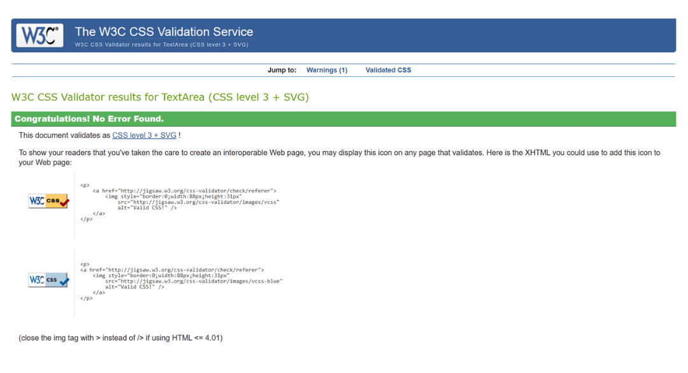

Error: When changeing DEBUG to False, the style was not applied.
Solution: I have not collect static files locally to collect static files into the STATIC_ROOT directory.
So, I collect:

```

python manage.py collectstatic

```

### Python

[Code Institute Python Linter](https://pep8ci.herokuapp.com/) was used to validate the python.

| File | Result |
| :--- | :--- |
| **STEAMAND LEAF** |
| [lizardmypet/urls.py](documentation/url.png) | Pass |  
| **BLOG** |
| [blog/views.py](documentation/views_blog.png) | minor issues: 60: E501 line too long (81 > 79 characters)
100: E303 too many blank lines (2), 135: E501 line too long (80 > 79 characters) | 
| [blog/models.py](documentation/models.png) | minor issues: 32: E501 line too long (130 > 79 characters),
51: E501 line too long (130 > 79 characters), 105: E501 line too long (102 > 79 characters) | 
| [blog/forms.py](documentation/forms.png) | Pass |
| [blog/urls.py](documentation/urls_blog.png) | Pass | 
| [blog/admin.py](documentation/admin.png) | Pass | 


## Visual (UI) Testing: Cross Browser and Cross Device Testing

- The below combination of devices, browsers were used to test the website. A range of viewport sizes were checked to see if users would have the same experience across multiple devices and browsers. Priority was given to mobile devices and tablets. 

| **TOOL / Device**           | **BROWSER**      | **SCREEN WIDTH** | Passed 
|-----------------------------|------------------|------------------|---------
| resp viewer: Galaxy Note 3  | Chrome           | 360 x 640 px     | yes
| resp viewer: Galaxy S9 Plus | Chrome           | 412 x 846 px     | yes
| resp viewer: iPad           | Chrome           | 446 x 1024 px    | yes
| real phone: Galaxy A52s 5G  | Chrome           | 1080 x 2400 px   | yes
| resp viewer: Laptop         | Chrome           | 1280 x 800 px    | yes
| resp viewer: Nexus 7        | Firefox          | 960 x 600 px     | yes
| dev tools:                  | Edge             | 780 x 995 px     | yes

## Lighthouse

For the performance, accessibility, best practices and SEO of the site for mobile and desktop, and the major pages were passed through the validation. 

#### Desktop Results

| Page | Result |
| :--- | :--- |
| Home Page | 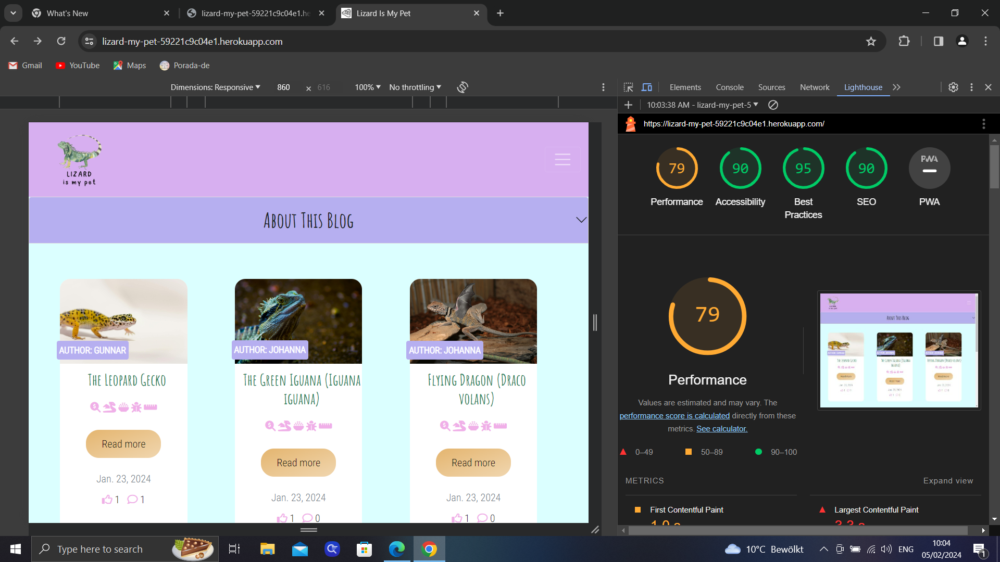 |
| Lizard Detail | 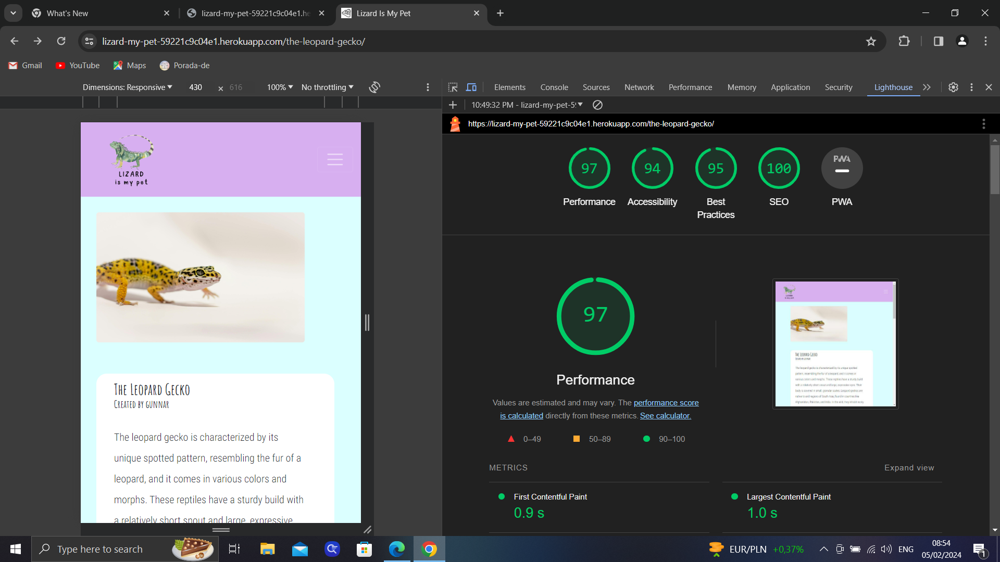 |
| Edit Experience | 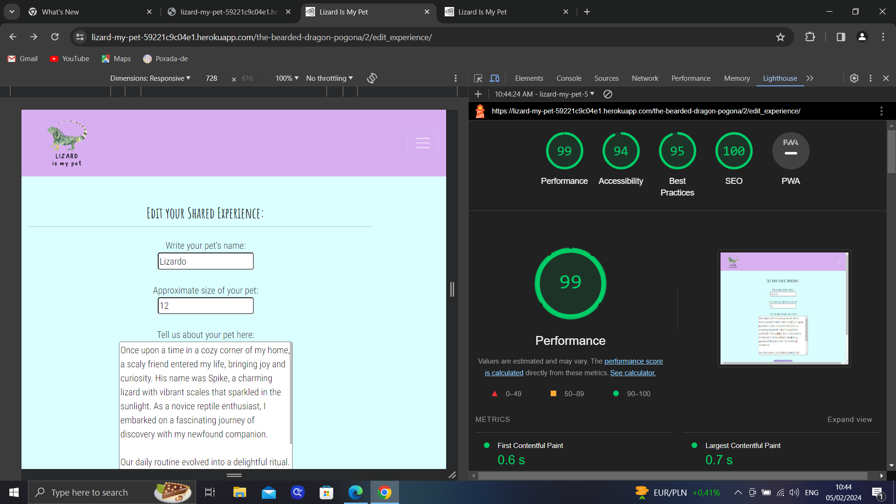 |
| Delete Experience | 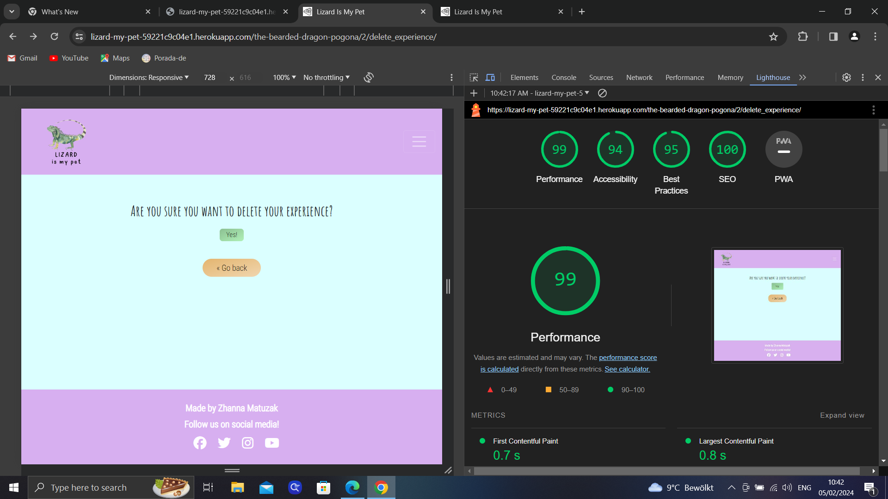 |
| Sign up |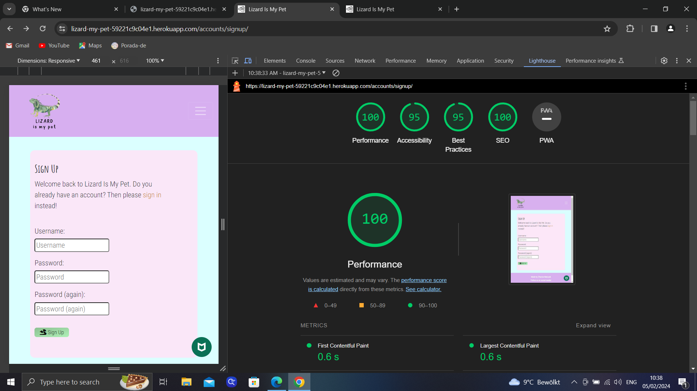 |
| Sign in | 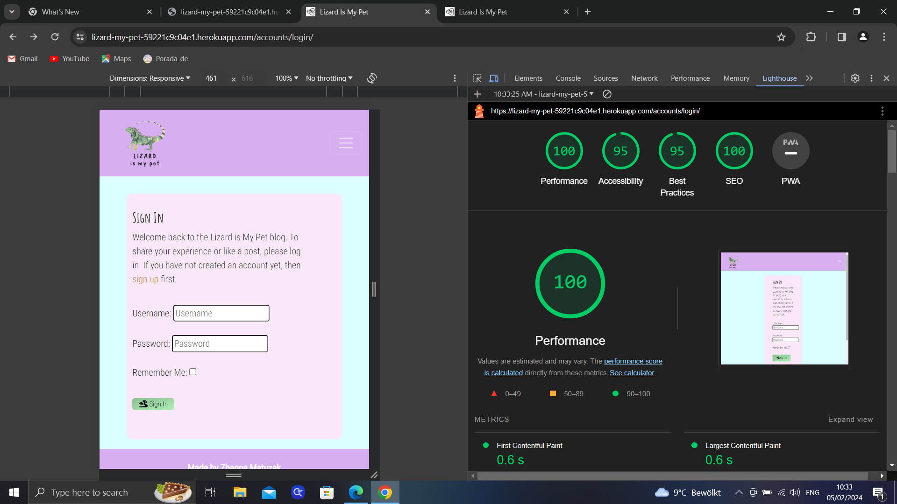 |

- Desktop performed well on all major pages of the site with minimal improvements needed.

#### Mobile Results

| Page | Result |
| :--- | :--- |
| Home Page | 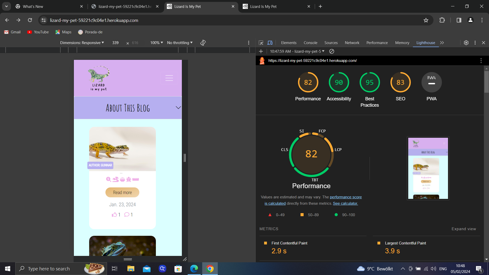 |
| Lizard Detail | 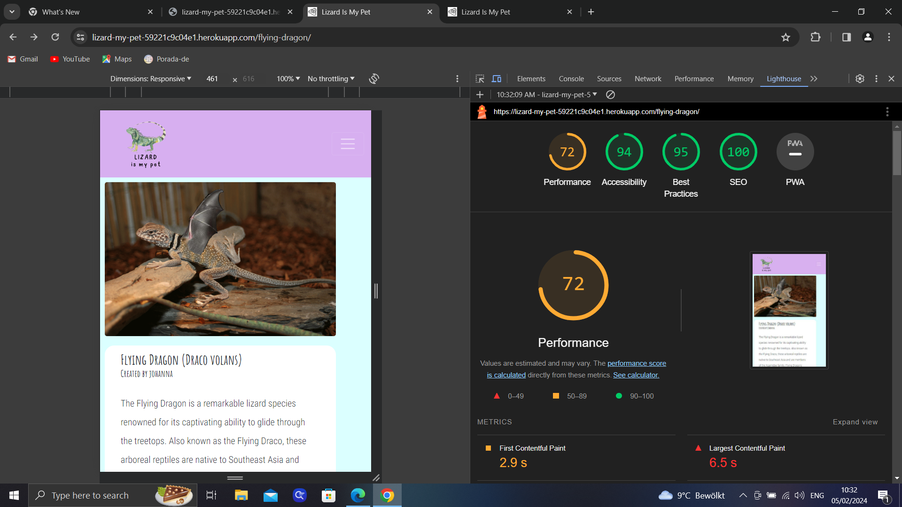 |
| Edit Experience | 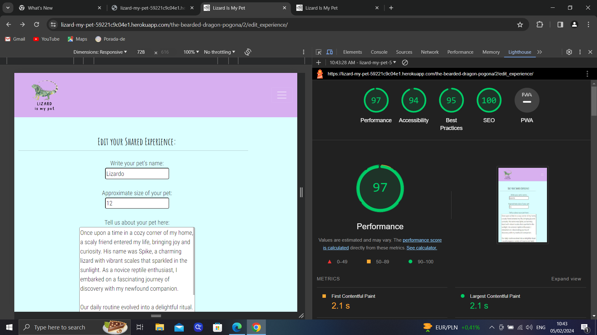 |
| Delete Experience | 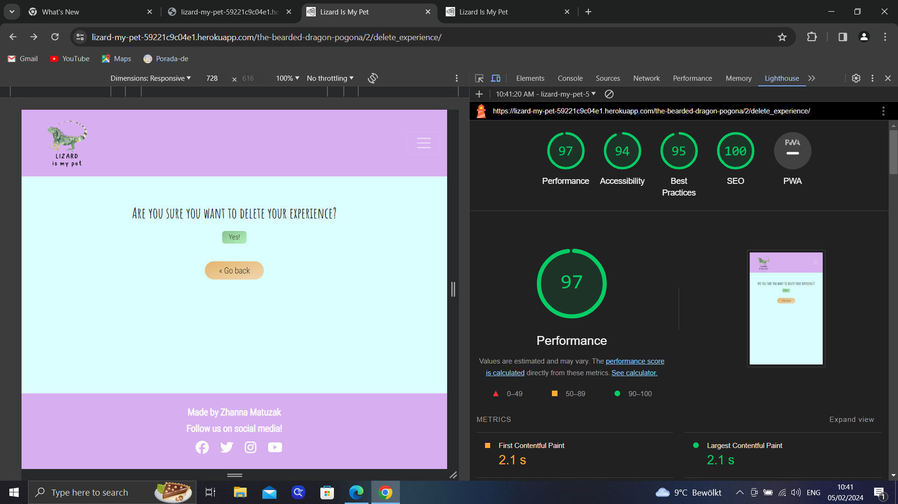 |
| Sign up | 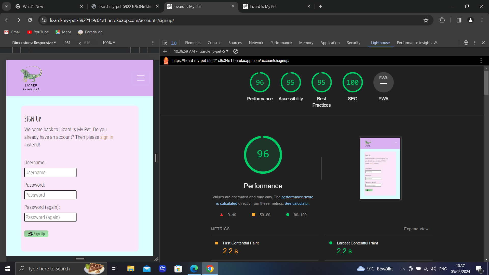 |
| Sign in | 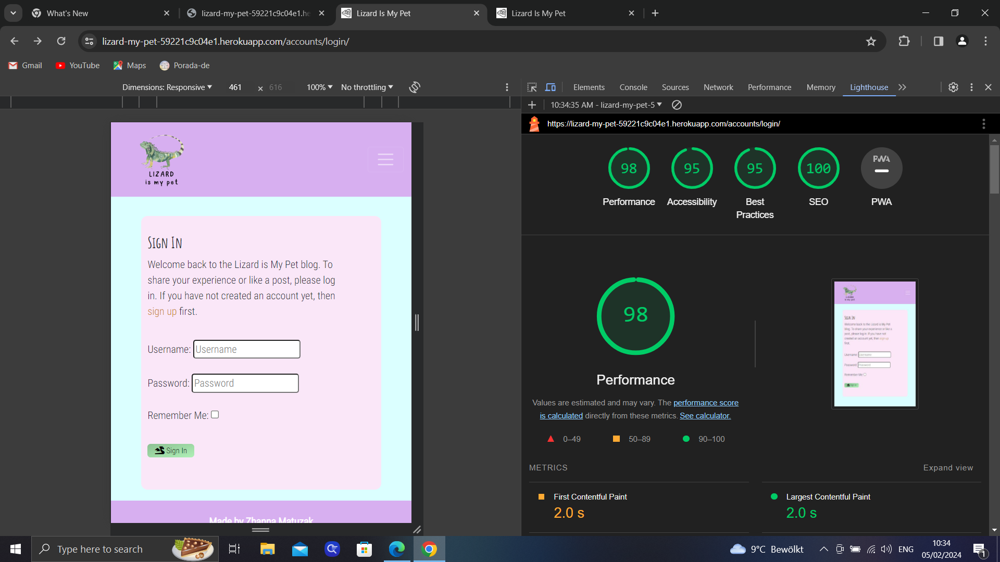 |

## Outstanding Defects
- There are no outstanding defects. 


