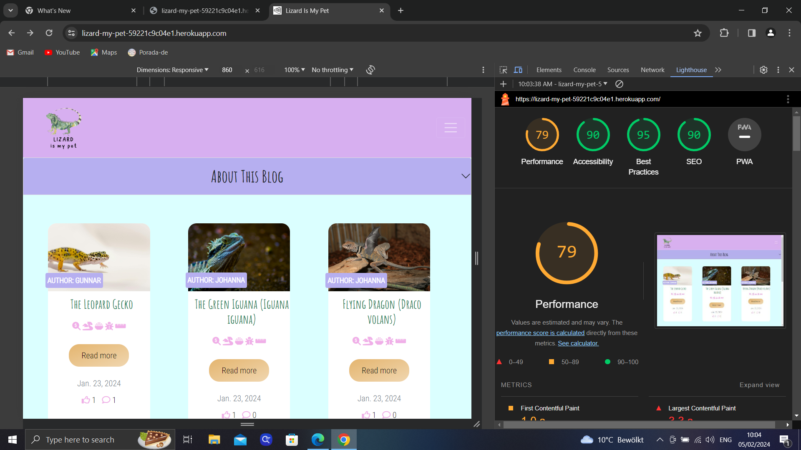
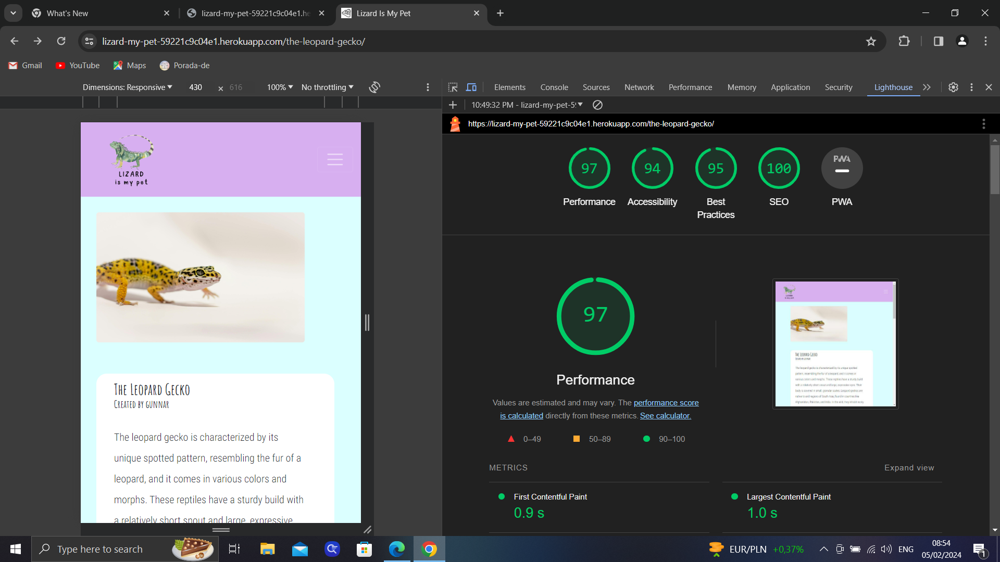
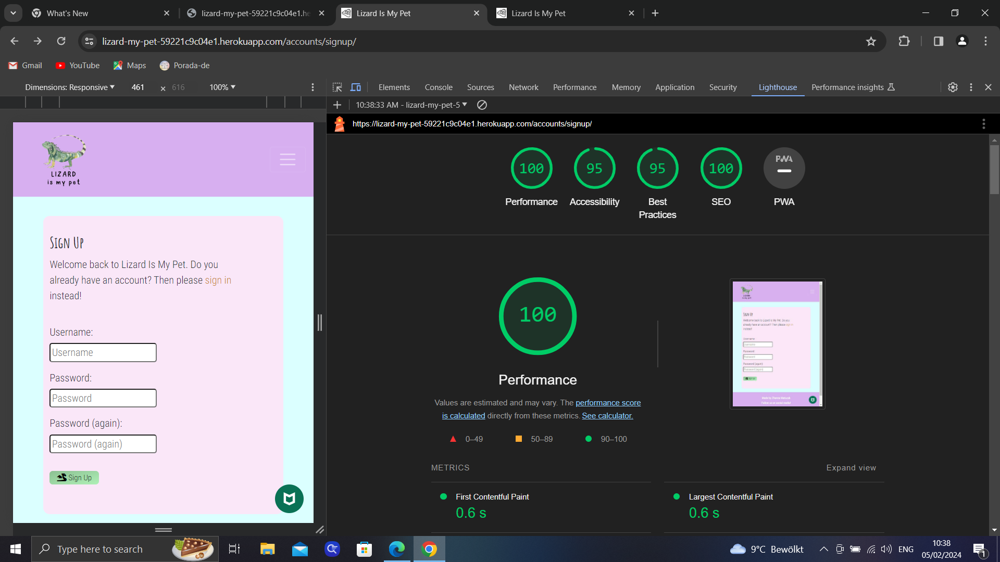
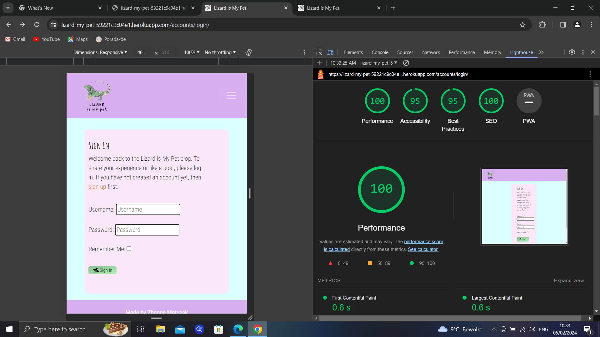
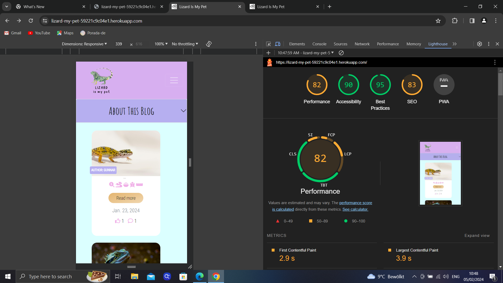
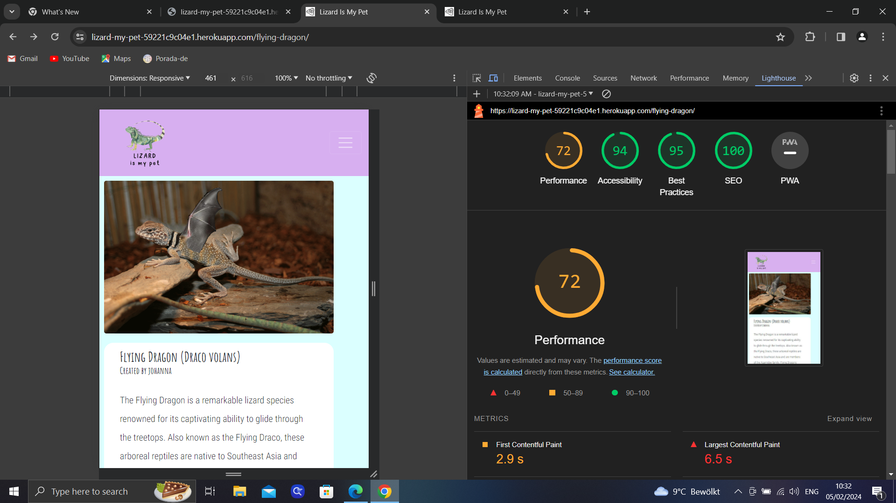
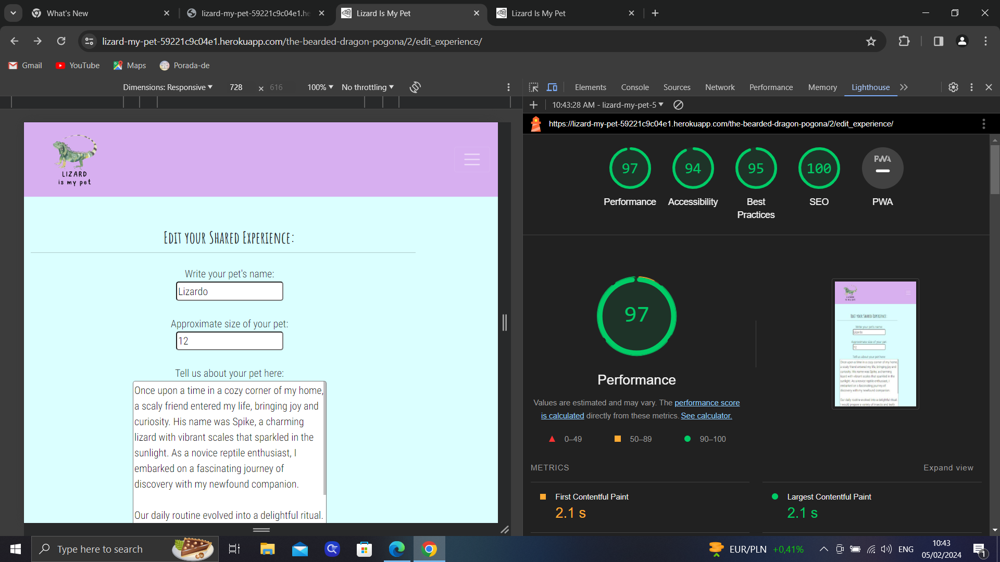
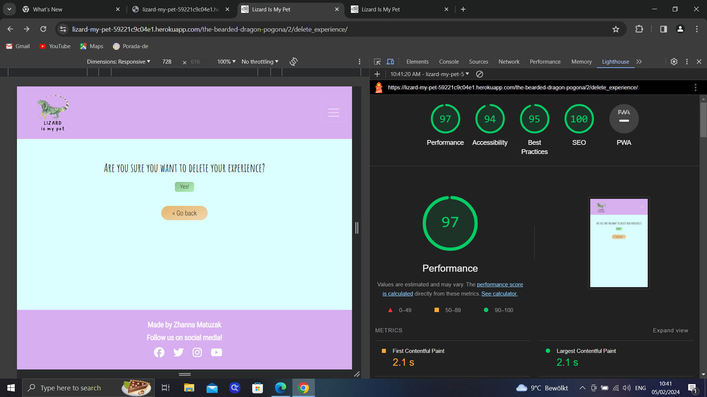
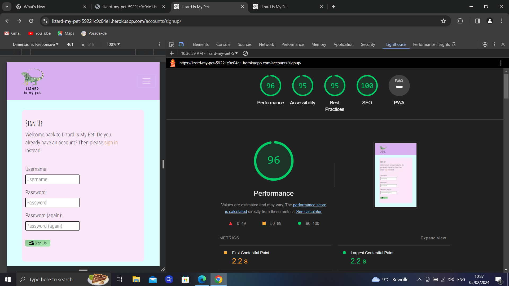
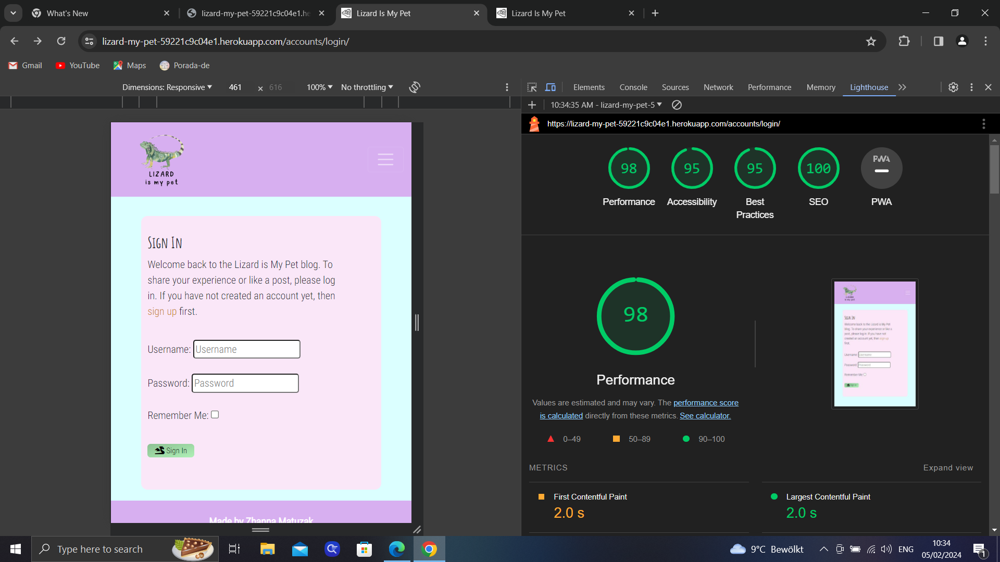

# Lizard Is My Pet - Testing Documentation

## Manual Testing

### Testing User Stories

- Each completed user story on the [sprint backlog](https://github.com/users/zhannamatuzak/projects/1) was tested against the acceptance criteria, see the corresponding screenshots as evidence.
- This included reviewing each feature to check the usability, visual design and performance.


| Milestone | [Create the full Backend](https://github.com/zhannamatuzak/lizard-my-pet/milestone/1) |
------------|---------------------------------------------------------------------------------------|

| Epic    | [Full User Managment](https://github.com/zhannamatuzak/lizard-my-pet/issues/3)  |
----------|--------------------------------------------------------------------------------|

| Title | Number | Definition | Completed? | Label |
|-------|--------|------------|------------|-------|
| USER STORY: Log in | [#2](https://github.com/zhannamatuzak/lizard-my-pet/issues/2) | As a **USER** I would like to log in with the registration credentials. | [x] | Must Have |
| USER STORY: Registration  | [#1](https://github.com/zhannamatuzak/lizard-my-pet/issues/1) | As a **USER**, I would like to have a registration form with no need of email authentication, so I can start writing experiences right away. | [x] | Must Have |
| USER STORY: Log out | [#4](https://github.com/zhannamatuzak/lizard-my-pet/issues/4) | As a **USER**, I would like to be able to log out. | [x] | Must Have |
| USER STORY: USER STORY - Authorization | [#4](4) | As an **ADMIN**, I would like that the user must be authorized in order to write his/her experiences (comments) under the posts. | [x] | Must Have |

| Epic    | [Manage posts]()  |
----------|-------------------|

| Title | Number | Definition | Completed? | Label |
|-------|--------|------------|------------|-------|
| USER STORY: Log in | [#2]() | | [x] | Must Have |
| USER STORY: Registration  | [#1]() |  | [x] | Must Have |
| USER STORY: Log out | [#4]() |  | [x] | Must Have |


## Validation Testing

### [HTML W3C Validator](https://validator.w3.org/) 
As this is a Django project, the HTML couldn't be tested via the site's URL, due to Django tags and Jinja templating language in HTML files. Instead, the source code of each page was pasted into the validator directly.

| Page | Result |
| :--- | :--- |
| [Home Page](documentation/) | Pass |
| [Lizard Detail](documentation/) | Pass |
| [Edit Experience](documentation/) | Pass |
| [Delete Experience](documentation/) | Pass |
| [Sign up](documentation/)| Pass |
| [Login](documentation/) | Pass |
| [Logout](documentation/) | Pass |
| [Error 404](documentation/) | Pass |

### CSS

[Jigsaw](https://jigsaw.w3.org/css-validator/) was used to validate the CSS.


Error: When changeing DEBUG to False, the style was not applied.
Solution: I have not collect static files locally to collect static files into the STATIC_ROOT directory.
So, I collect:

```

python manage.py collectstatic

```

### Python

[Code Institute Python Linter](https://pep8ci.herokuapp.com/) was used to validate the python.

| File | Result |
| :--- | :--- |
| **STEAMAND LEAF** |
| [stemandleaf/urls.py](documentation/) | Pass |  
| **BLOG** |
| [blog/views.py](documentation/) | Pass | 
| [blog/models.py](documentation/) | Pass | 
| [blog/forms.py](documentation/) | Pass |
| [blog/urls.py](documentation/) | Pass | 
| [blog/admin.py](documentation/) | Pass | 


## Visual (UI) Testing: Cross Browser and Cross Device Testing

- The below combination of devices, browsers were used to test the website. A range of viewport sizes were checked to see if users would have the same experience across multiple devices and browsers. Priority was given to mobile devices and tablets. 

| **TOOL / Device**           | **BROWSER**      | **SCREEN WIDTH** | Passed 
|-----------------------------|------------------|------------------|---------
| resp viewer: Galaxy Note 3  | Chrome           | 360 x 640 px     | yes
| resp viewer: Galaxy S9 Plus | Chrome           | 412 x 846 px     | yes
| resp viewer: iPad           | Chrome           | 446 x 1024 px    | yes
| real phone: Galaxy A52s 5G  | Chrome           | 1080 x 2400 px   | yes
| resp viewer: Laptop         | Chrome           | 1280 x 800 px    | yes
| resp viewer: Nexus 7        | Firefox          | 960 x 600 px     | yes
| dev tools:                  | Edge             | 780 x 995 px     | yes

## Lighthouse

For the performance, accessibility, best practices and SEO of the site for mobile and desktop, [Page Speed](https://pagespeed.web.dev/) and the major pages were passed through the validation. 

#### Desktop Results

| Page | Result |
| :--- | :--- |
| Home Page |  |
| Lizard Detail |  |
| Edit Experience !| ([edit experience](image-13.png)) |
| Delete Experience !| [delete experience](image-11.png) |
| Sign up | |
| Sign in |  |

- Desktop performed well on all major pages of the site with minimal improvements needed.

#### Mobile Results

| Page | Result |
| :--- | :--- |
| Home Page |  |
| Lizard Detail |  |
| Edit Experience |  |
| Delete Experience |  |
| Sign up |  |
| Sign in |  |

## Outstanding Defects
- There are no outstanding defects.


